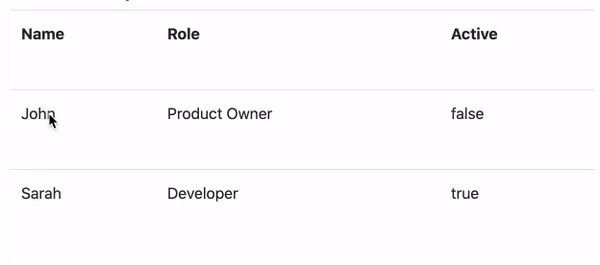

<p align="center">
 
</p>

<br />

[]()
[]()
[]()
[](https://github.com/prettier/prettier)
[](#contributors-2)
[](https://github.com/ngneat/)
[]()

> A flexible and unopinionated edit in place library for Angular applications

Edit in place is a complete solution for switching modes between static content and an editable control that allows editing it.

Following open/closed principle, the library focuses on the switch mechanism, giving you full control of the data you want to update and the content you want to display and how to edit it.



[Demo](https://ngneat.github.io/edit-in-place)

## Features

- ✅ Fully customizable
- ✅ Manual trigger support 
- ✅ Reactive Forms support
- ✅ Multiple Forms support

## Installation

`ng add @ngneat/edit-in-place`

## Usage

Add the `EditableModule` to your `AppModule`.

```typescript
import { EditableModule } from '@ngneat/edit-in-place';

@NgModule({
  declarations: [AppComponent],
  imports: [EditableModule],
  bootstrap: [AppComponent]
})
export class AppModule {}
```

Now you can use the `<editable>` component:

```ts
@Component({
  template: `
    <editable (save)="update()" (cancel)="cancel()">
      <ng-template viewMode>{{ value }}</ng-template>

      <ng-template editMode>
        <input editableOnEnter editableOnEscape [formControl]="control" />
      </ng-template>
    </editable>
  `
})
class MyComponent {
  value = 'foo';
  control = new FormControl(this.value);

  update() {
    this.value = this.control.value;
  }

  cancel() {
    this.control.setValue(this.value);
  }
}
```

For more complex examples, check out the [playground](https://github.com/ngneat/edit-in-place/blob/master/src/app/app.component.html).

### Changing the Active Mode

Click on the `viewMode` template to switch it to `editMode` or click outside the editable component to switch back to `viewMode`.

You can customize the switch trigger by providing a `MouseEvent` type:

```html
<editable openBindingEvent="dblclick"
          closeBindingEvent="dblclick">
    ...
</editable>
```

You can set this value globally by providing it in the `EDITABLE_CONFIG` provider:

```typescript
@NgModule({
  ...
  providers: [
    {
      provide: EDITABLE_CONFIG, 
      useValue: {
        openBindingEvent: 'dblclick',
        closeBindingEvent: 'dblclick',
      } as EditableConfig
    }
  ]
})
export class AppModule {}
```


## Handle Events Manually

You can use the `editableOnUpdate` and `editableOnCancel` directives to trigger the update or the reset of the value on chosen elements.

```html
<editable (save)="updateField()" (cancel)="resetField()">
  <ng-template viewMode>...</ng-template>

  <ng-template editMode>
    <input formControlName="name">
    <button editableOnSave>Save</button>
    <button editableOnCancel>Cancel</button>    
  </ng-template>
</editable>
```

## Handle Focus

As a focusable form tag might be nested or custom, it isn't focused by default when the `editMode` is displayed.

To make it focusable, you can add the `editableFocus` directive on the input:

```html
<editable>

  <ng-template viewMode>
    ... 
  </ng-template>

  <ng-template editMode>
    <input editableFocusable formControlName="name">   
  </ng-template>
</editable>
```

## Events

Add the `(save)` event binding to handle the update of the content. 

```html
<editable (save)="updateField()">
   ...
</editable>
```

The following actions will trigger this event:

- `editableOnEnter` directive
- `editableOnSave` directive
- `closeBindingEvent` @Input() MouseEvent


Optionally you can add the `(cancel)` event binding to handle the reset of the value of a formControl:

```html
<editable (cancel)="resetField()">
  ...
</editable>
```

The following actions will trigger this event:

- `editableCancel` directive
- `editableOnEscape` directive

## Inputs

| @Input                 | Type                      | Description                                                  | Default                                                                |
| ---------------------- | ------------------------- | ------------------------------------------------------------ | ---------------------------------------------------------------------- |
| openBindingEvent       | `string`                  | The MouseEvent type to display the editMode                  | `click`                                                              |
| closeBindingEvent      | `string`                  | The MouseEvent type to display the viewMode                  | `click`                                                                 |

## Outputs

| @Output                | Type                      | Description                                                                                                               |
| ---------------------- | ------------------------- | ------------------------------------------------------------
| save                   | `void`                    | triggered by the editableOnSave and editableOnEnter directives and the MouseEvent on closeBindingEvent @Input                                                                               |
| cancel                 | `void`                    | triggered by the editableCancel and editableOnEscape directives                                                                                 |


## Directives

#### editableFocusable

Focus the host element when switching to `editMode` (for nested inputs).

#### editableOnEnter

Listen to keyup `enter` to switch to `viewMode` and update the value of the `viewMode` host element.

#### editableOnEscape

Listen to keyup `escape` to switch to `viewMode` without updating the value of the `viewMode` host element.

#### editableOnSave

Listen to a `MouseEvent` on ths host element in order to switch to `viewMode` and udpate the value of the content of the `viewMode`*host element.

| @Input                 | Type                      | Description                                                  | Default                                                                |
| ---------------------- | ------------------------- | ------------------------------------------------------------ | ---------------------------------------------------------------------- |
| saveEvent              | `string`                  | The MouseEvent type used to trigger the @Output() save       | `click`                                                              |


#### editableOnCancel

Listen to a `MouseEvent` on ths host element in order to trigger to switch to `viewMode` without updating the value of the `viewMode` host element.


| @Input                 | Type                      | Description                                                  | Default                                                                |
| ---------------------- | ------------------------- | ------------------------------------------------------------ | ---------------------------------------------------------------------- |
| cancelEvent            | `string`                  | The MouseEvent type used to trigger the @Output() cancel     | `click`                                                              |


## Multiple Forms Usage

edit-in-place also supports switching between modes for multiple components at once.

Add the `editableGroup` directive on a parent html tag of your `editable` components:

```html
<section editableGroup>
  <editable></editable>
  <editable></editable>
  <editable></editable>
</section>
```

### Changing the Active Mode

> Unlike using a single `editable` component, an `editableGroup` doesn't support `MouseEvent` events on the component to switch modes.

You can switch modes by using dedicated directives on html button tag to switch mode for the whole group:

- `editableGroupEdit` to switch to `editMode`
- `editableGroupSave` to save the value of each form tag and switch to `viewMode`
- `editableGroupCancel` to switch to `viewMode` without saving the value of each form tag

```html
<section editableGroup>
  <button editableGroupEdit>Edit</button>
  <button editableGroupSave>Save</button>
  <button editableGroupCancel>Cancel</button>
  <editable></editable>
  <editable></editable>
  <editable></editable>
</section>
```

Add the `(editableModeChange)` event binding to keep track of the active mode.   

It's triggered by the `editableGroupEdit`, `editableGroupSave` and `editableGroupCancel` directives.

```html
<section (editableModeChange)="handleModeChange($event)">
  <editable></editable>
  <editable></editable>
  <editable></editable>
</section>
```

Add the `(save)` event binding to handle the update of the group.   
It's triggered by the `editableGroupSave` directive:

```html
<section (save)="updateGroup()">
  <editable></editable>
  <editable></editable>
  <editable></editable>
</section>
```

Optionally you can add the `(cancel)` event binding to handle the reset of the value of the group.

It's triggered by the `editableGroupCancel`:

```html
<section (cancel)="cancelUpdate()">
  <editable></editable>
  <editable></editable>
  <editable></editable>
</section>
```

## Directives

#### editableGroup

Overcharges the behavior of children editable Components to work as one entity.

| @Output                | Type                      | Description                                                                                                               |
| ---------------------- | ------------------------- | ------------------------------------------------------------
| save                   | `void`                    | triggered by the editableGroupSave directive                                                                           |
| cancel                 | `void`                    | triggered by the editableGroupCancel directive                                                                               |
| editableModeChange     | `'view'` or `'edit'`      | triggered by the editableGroupEdit, editableGroupSave and editableGroupCancel directives when switching modes                                                                              |


#### editableGroupEdit

Listen to a click `MouseEvent` to switch to *editMode*.


#### editableGroupSave

Listen to a click `MouseEvent` to switch to *viewMode* and update the value of the group.


#### editableGroupCancel

Listen to a click `MouseEvent` to switch to *viewMode* without updating the value of the group.


## Contributors ✨

Thanks goes to these wonderful people ([emoji key](https://allcontributors.org/docs/en/emoji-key)):

<!-- ALL-CONTRIBUTORS-LIST:START - Do not remove or modify this section -->
<!-- prettier-ignore-start -->
<!-- markdownlint-disable -->
<table>
  <tr>
    <td align="center"><a href="https://gerome-dev.netlify.com/"><br /><sub><b>Gérôme Grignon</b></sub></a><br /><a href="https://github.com/@ngneat/edit-in-place/commits?author=geromegrignon" title="Code">💻</a> <a href="https://github.com/@ngneat/edit-in-place/commits?author=geromegrignon" title="Documentation">📖</a> <a href="#ideas-geromegrignon" title="Ideas, Planning, & Feedback">🤔</a></td>
    <td align="center"><a href="https://www.netbasal.com/"><br /><sub><b>Netanel Basal</b></sub></a><br /><a href="#blog-NetanelBasal" title="Blogposts">📝</a> <a href="https://github.com/@ngneat/edit-in-place/commits?author=NetanelBasal" title="Documentation">📖</a> <a href="#ideas-NetanelBasal" title="Ideas, Planning, & Feedback">🤔</a></td>
  </tr>
</table>

<!-- markdownlint-enable -->
<!-- prettier-ignore-end -->
<!-- ALL-CONTRIBUTORS-LIST:END -->

This project follows the [all-contributors](https://github.com/all-contributors/all-contributors) specification. Contributions of any kind welcome!

Logo made by <a href="https://www.flaticon.com/authors/freepik" title="Freepik">Freepik</a> from <a href="https://www.flaticon.com/" title="Flaticon"> www.flaticon.com</a>
